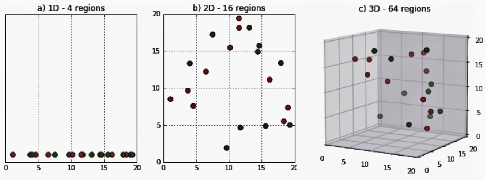
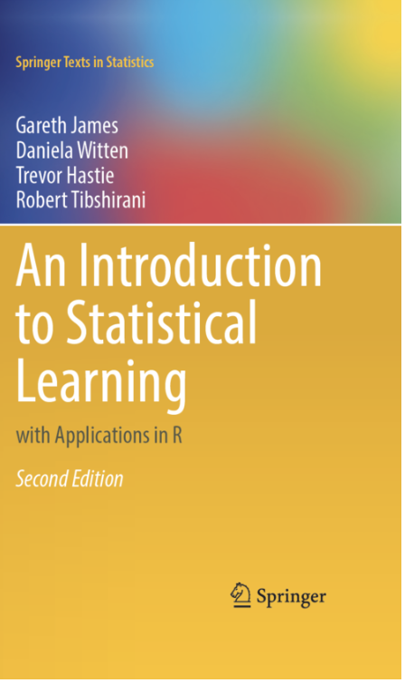
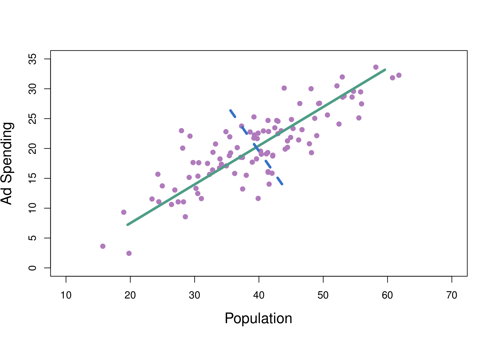
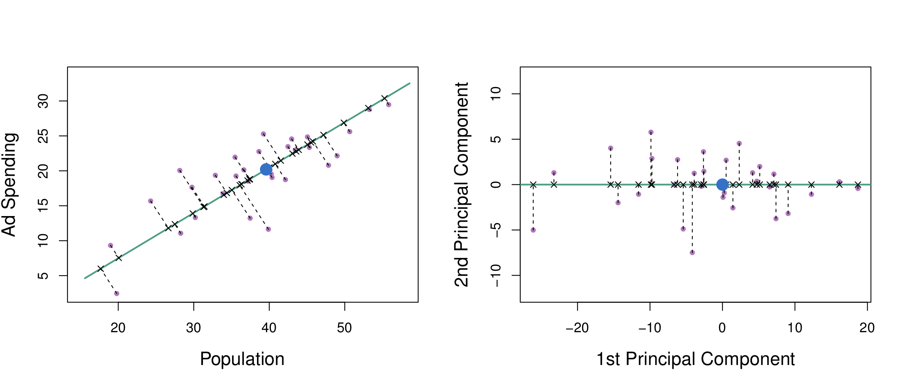

```{r setup, include=FALSE}
knitr::opts_chunk$set(echo = TRUE)
```

## Hello!
- Jonesboro High School Class of 2006!
- B.S. Genetics (2010), Texas A&M University  
- Ph.D. Integrative Biology (2017), Oregon State University  
- Post-doc in Bioinformatics & Plant Genomics (2017 - 2019), Reed College & Penn State 
- Research Assistant Professor (2019 - 2020), A-State
- Assistant Professor of Bioinformatics (2020 - Present), A-State 

Check out our research and team here: https://em-bellis.github.io

## Why do we need feature selection?
- How many features (predictors) do you have in your dataset?   

## The curse of dimensionality  
As the dimensionality of the dataset increases, the feature space becomes exponentially more sparse (image: [N. Raj](https://medium.com/analytics-vidhya/the-curse-of-dimensionality-and-its-cure-f9891ab72e5c)).
<center>
{ width=100%} 

</center>

## The curse of dimensionality  
In higher dimensions, it becomes easier to separate the data points, but this can also result in overfitting (fitting noise), especially if there are many features unrelated to the response. 

We can 1) add more data or 2) reduce the number of features/dimensions.

## Reducing the number of features/dimensions   
+ Feature Selection
  + Subset selection  
    +  Identify a subset of all $p$ predictors we believe are related to the response, and then fit the model using this subset
    + e.g. best subset selection
  + Shrinkage/Regularization
    + Some of the coefficients may shrink to exactly zero (i.e. the LASSO)
+ **Dimension Reduction**  
    + Project all $p$ predictors into an $M$-dimensional space where $M < p$, and then perform linear regression model (e.g. principal components regression) 
    
## Introduction to Statistical Learning 
- Hands-on introduction to computational aspects of statistical learning with real-world data.  
- Labs in both R & Python 
- Freely available at https://www.statlearning.com 
- Check out Chp. 6 for more on Feature Selection and Chp. 12 for PCA 

<center>
{ width=25% } 

</center>  

## Dimension Reduction via Principal Components Regression 
1. Project all $p$ predictors into an $M$-dimensional space where $M < p$ [e.g. through PCA]. 

2. Fit a least squares model using $M$ < $p$ transformed variables [e.g. through linear regression]. 

<center>
{ width=45% } 

</center> 

## Principal Components Analysis  
- PCA finds a small number of dimensions (principal components) that are each a linear combination of the *p* features and capture as much as possible of the variation. 

- The first principal component is the normalized linear combination of the features that has the largest variance. 

- After the first principal component has been determined, we find the second PC as the linear combination of predictors that has maximal variance, out of all linear combinations that are uncorrelated with the first PC. 

## In the *M*-dimensional space: 
$Z_1, Z_2, ..., Z_M$ represent $M$ linear combinations of the original $p$ predictors $X_1, X_2, ..., X_p$:
$$ Z_m = \sum_{j=1}^p\phi_{jm}X_j$$

$Z_1$: The first **principal component** of a set of features $X_1, X_2, ..., X_p$ 

$z_{i1}$: The first **principal component score** for the $i$th observation: 

$\phi_{11}, ..., \phi_{p1}$: the *loadings* of the first principal component  

## Example of PCA with two dimensions 
<center>
{ width=70% } 

</center>
Population size and ad spending for 100 different cities. green line: PC1; blue line: PC2

$Z_1$ and $Z_2$ are orthogonal.  

## Example of PCA with two dimensions
<center>
{ width=70% } 

</center>

Population size and ad spending for 100 different cities. green line: PC1; blue dot: population mean  

## Example of PCA with two dimensions
Computing the first PC gives us loadings for the `pop` and `ad` predictors. From this, we can determine the projection of the *i*th observation along PC1 (the *principal component score*).

Consider a point where Population = 20 and Ad Spending = 10:

$$z_{i1} = 0.839 \times (\text{pop}_i - \overline{\text{pop}}) + 0.544 \times (\text{ad}_i - \overline{\text{ad}})$$
$$z_{i1} = 0.839 \times (20 - 40) + 0.544 \times (10 - 20)$$
$$z_{i1} = -22.22$$


